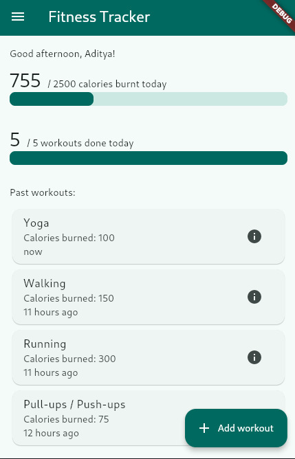
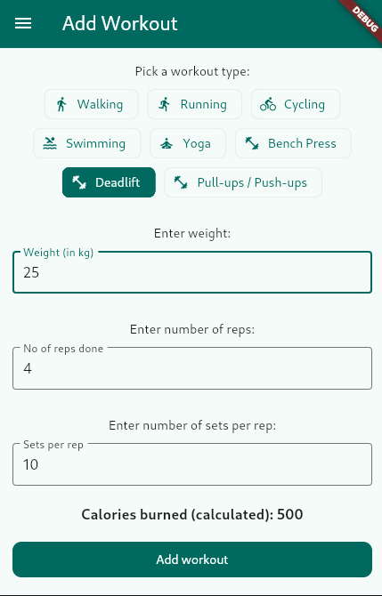
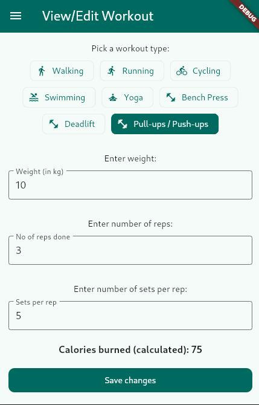
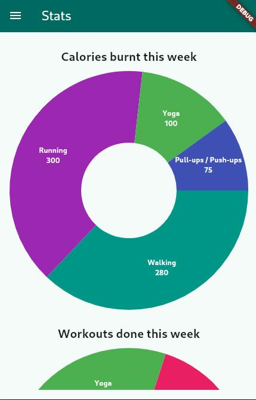
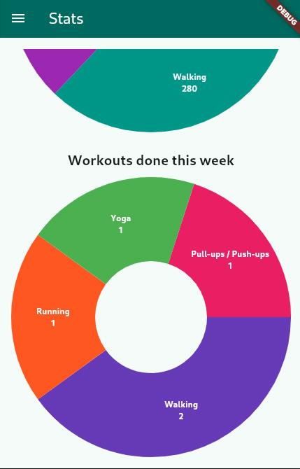

# Fitness Tracker Flutter App

Developed as the 1st year skill lab project on "Mobile App Development using Flutter"

Uses Hive for local data storage, FL Chart, material UI, flutter state management, dynamic forms, relative time

## Screenshots

